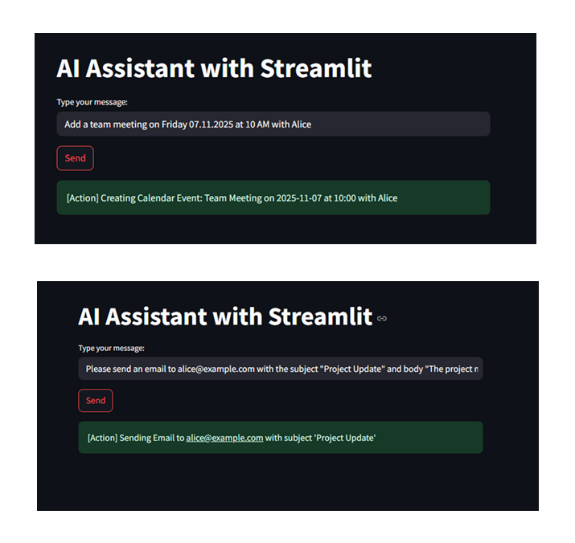
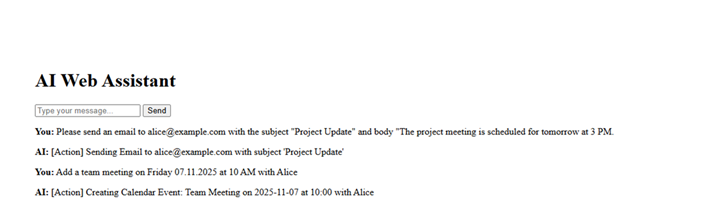

Here is a **professional README.md** you can copy directly into your repository.
(Screenshot placeholders included — replace with your images later.)

---

### ✅ **README.md (Ready to copy)**

```markdown
# 🤖 AI Assistant — OpenAI Responses API Examples  
_Automate. Stream. Execute real actions with AI._

---

## 🚀 Overview

This repository contains multiple **real-world examples** demonstrating how to build an AI assistant using the **OpenAI Responses API** with:

✅ Function / Tool calling  
✅ Streaming responses (real-time incremental text output)  
✅ FastAPI backend + streaming to browser  
✅ Streamlit chatbot application  
✅ Persistent conversation history  
✅ Modular architecture for adding new actions (send email, calendar event, etc.)

---

## 🖥️ Demo Screenshots

| Streamlit Chatbot UI | FastAPI + Web Frontend |
|--------------------|----------------------|
|  |  |

> *(Add screenshots into `/screenshots` folder — the file names will match.)*

---

## 📂 Project Structure

```

ai-web-assistant/
│
├── main.py                 # FastAPI app (streaming + tool execution)
├── config.py               # API key config (ignored via .gitignore)
├── requirements.txt
│
├── templates/
│   └── index.html          # Browser chat frontend (FastAPI app)
│
├── static/
│   └── script.js           # Frontend JS for streaming messages
│
├── screenshots/
│   ├── streamlit_ui.png
│   ├── fastapi_ui.png

````

---

## ✨ Features

| Feature | Description |
|--------|-------------|
| 🛠️ **Tool Calling** | AI calls real Python functions — calendar event, email, etc. |
| ⚡ **Streaming Responses** | Real-time word-by-word streaming from OpenAI |
| 🔄 **Persistent Memory** | Saves conversation history into JSON |
| 🌐 **FastAPI SSE Endpoint** | Browser connects and streams messages |
| 🪄 **Streamlit UI** | Minimal chat app with real-time response streaming |

---

## 🔧 Tool Calling Examples

### ✔️ Example: Calendar Event (AI triggers a Python function)

```python
def create_calendar_event(title, date, time, attendee):
    return f"[Action] Calendar event: {title} on {date} at {time} with {attendee}"
````

### ✔️ Example: Send an Email

```python
def send_email(to, subject, body):
    return f"[Action] Sending Email to {to} | Subject: {subject}"
```

---

## 🧠 OpenAI Responses API (streaming)

```python
stream = client.responses.create(
    model="gpt-4.1-mini",
    input=messages,
    tools=tools,
    stream=True
)
```

Events are streamed:

```python
for event in stream:
    if event.type == "response.output_text.delta":
        print(event.delta) # <-- streaming text
```

---

## ▶️ Run the Streamlit App

```bash
streamlit run app.py
```

---

## ▶️ Run the FastAPI Backend

```bash
uvicorn main:app --reload
```

Open browser:
👉 [http://127.0.0.1:8000](http://127.0.0.1:8000)

---

## 🔐 Configuration

Create `config.py` (not pushed to GitHub):

```python
OPENAI_API_KEY = "your_key_here"
```

---

## 📦 Install Dependencies

```bash
pip install -r requirements.txt
```

`requirements.txt`

```
openai
fastapi
uvicorn
streamlit
jinja2
python-dotenv
python-multipart
```

---


And add to `tools[]`.

---

## 🤝 Contributing

PRs are welcome!
Feel free to add new tools / examples.

---

## 📄 License

This project is released under the **MIT License**.

---

**⭐ If this repository helped you, give it a star!**

```

